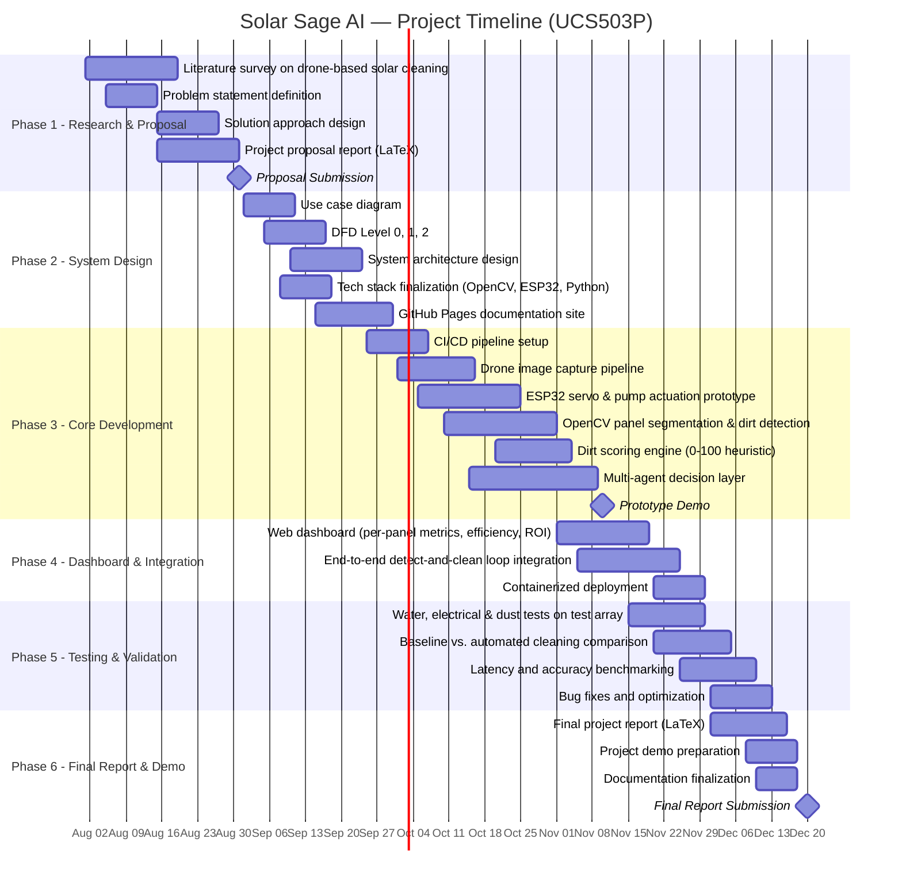

# 📐 Diagrams

This section contains all system design diagrams for the Solar Sage AI project.

## Use Case Diagram

The use case diagram shows the interactions between actors (Operator, Drone, System) and the core functionalities of the Solar Sage AI platform.

{ width="100%" loading=lazy }

---

## Data Flow Diagrams

### Level 0 — Context Diagram

The context-level DFD shows the system as a single process with external entities (Operator, Drone, Solar Panels) and the data flows between them.

{ width="100%" loading=lazy }

---

### Level 1 — Subsystem Diagram

The Level 1 DFD breaks the system into its major subsystems: Image Processing, Decision Engine, Actuation Controller, and Dashboard.

{ width="100%" loading=lazy }

---

### Level 2 — Detailed Diagram

The Level 2 DFD provides a granular view of internal data flows within each subsystem, including the multi-agent decision pipeline.

{ width="100%" loading=lazy }

---

## Gantt Chart — Project Timeline

The Gantt chart shows the complete project timeline across all six phases, from research through final demo, with task dependencies and milestone markers.

