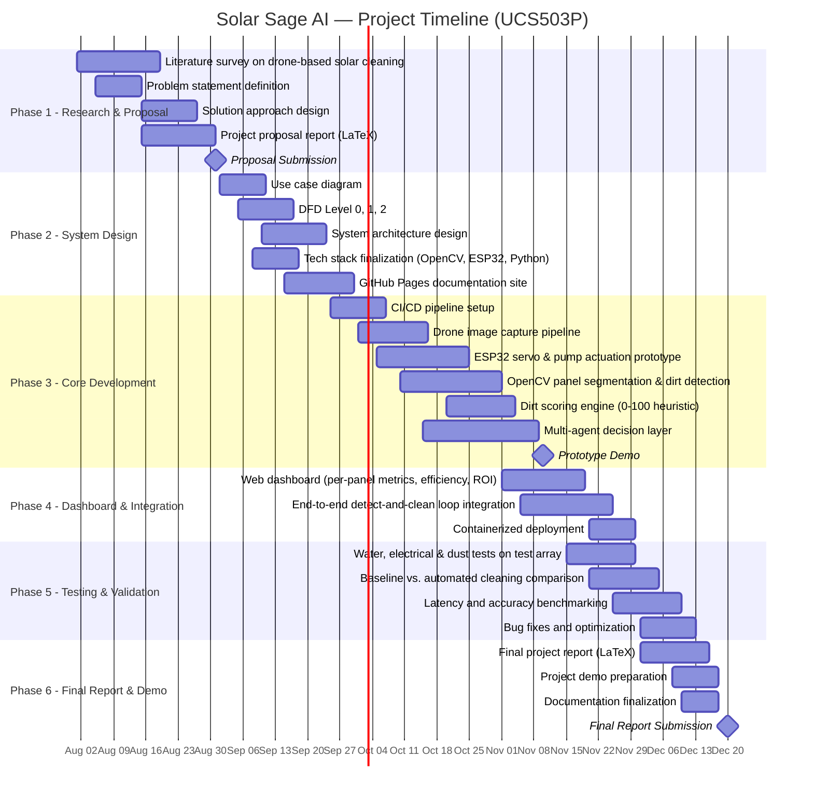

# 🗺️ Roadmap

## Project Phases

  

    Phase 1 — Foundation
    <h4>Core Perception & Actuation Prototype</h4>
    
Drone image capture, OpenCV-based panel segmentation, basic dirt detection, and ESP32 servo/pump control prototype. CI pipeline setup with linting and basic tests.

  

  

    Phase 2 — Integration
    <h4>End-to-End Detect-and-Clean Loop</h4>
    
Full pipeline integration: image → detection → scoring → actuation. Dirt scoring on a 0–100 scale with heuristic thresholds. Basic logging for latency measurement.

  

  

    Phase 3 — Intelligence
    <h4>Multi-Agent Decision Layer</h4>
    
Deploy five specialized agents (confidence, priority, benchmarking, ROI, water optimization) that collaboratively determine cleaning actions.

  

  

    Phase 4 — Dashboard
    <h4>Monitoring & ROI Reporting</h4>
    
Web-based dashboard showing per-panel dirt scores, efficiency gains, cost savings, and historical trends. Containerized deployment with CI/CD.

  

  

    Phase 5 — Validation
    <h4>Field Testing & Benchmarking</h4>
    
Water, electrical, and dust tests on a test array. Before/after comparison against manual cleaning baseline. Publish evaluation metrics.

  

  

    Stretch Goal
    <h4>Learned Classification</h4>
    
Replace heuristic thresholds with a trained model for improved edge-case accuracy. Multi-drone coordination for larger panel fields.

  

---

## Visual Timeline — Gantt Chart

The interactive Gantt chart below details all 6 project phases, tasks, dependencies, and milestones from August to December 2026:

---

## Deliverables Summary

### Iteration 1 (Initial)
- [x] Drone image capture setup
- [x] OpenCV-based detection and segmentation
- [x] Basic dirt-level scoring (0–100)
- [x] ESP32 servo and pump actuation prototype
- [x] Basic logging and latency timestamps
- [x] CI: build, firmware/backend tests, linting

### Iteration 2+ (Subsequent)
- [ ] Full multi-agent decision layer
- [ ] Dashboard for per-panel metrics and ROI
- [ ] Extended field validation tests
- [ ] Stretch: learned dirt classification

## Risks & Mitigations

| Risk | Mitigation |
|:-----|:-----------|
| Low-light / glare reducing detection accuracy | Combine RGB with thermal imaging; schedule flights in optimal lighting |
| False-positive cleaning triggers | Confidence agent suppresses low-confidence detections before actuation |
| Hardware / weather delays | Buffer window in final project phase for field-testing |
| Measurement ambiguity | Baseline measurements taken under matched conditions before comparison |
